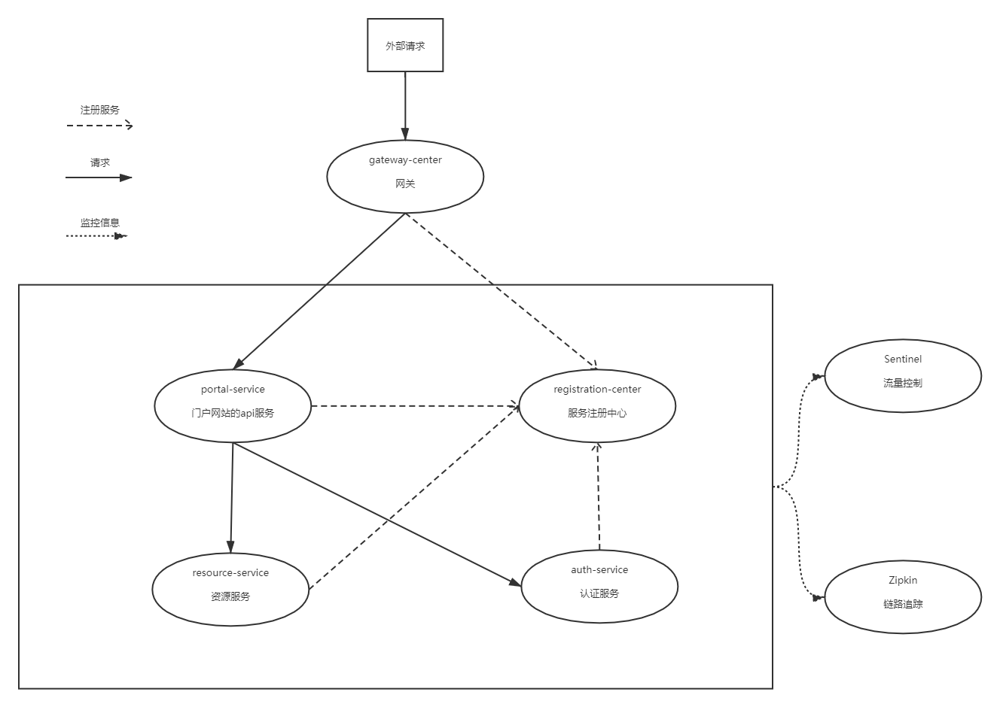

# 简介

此项目是用于搭建Spring Cloud项目，版本为Finchley，包含 `网关`，`注册中心`，`服务消费`，`服务链路追踪 `，`流量控制`，以及三个微服务



# 项目模块介绍

### 注册中心

`registration-center`模块为注册中心，使用的 `eureka`，可以稍作修改切换为 `consul`或者是 `Nacos`

### 网关

`gateway-center`模块为网关，使用的 `gateway`，Spring Cloud F版本已经不支持使用 `Zuul`作为网关，

使用 `gateway`作为网关时，因为对性能要求比较高，所以web框架使用的使Web Flux

### 服务链路追踪

链路追踪使用的使 `Zipkin`和 `sleuth`，在三个微服务中都有使用，`Zipkin`的新版本已经不需要手动搭建Zipkin Server了，直接下载jar包运行即可，默认的端口为9411

Zipkin Server的镜像下载地址：[下载](https://dl.bintray.com/openzipkin/maven/io/zipkin/java/zipkin-server/)

### 流量控制

流量控制使用阿里的 `sentinel`，在三个微服务中添加如下依赖

```
        <dependency>
            <groupId>org.springframework.cloud</groupId>
            <artifactId>spring-cloud-alibaba-sentinel</artifactId>
            <version>0.2.1.RELEASE</version>
        </dependency>
```

然后还需要下载 `Sentinel Dashboard`，下载地址：[下载](https://github.com/alibaba/Sentinel/releases)。下载后运行jar包，默认端口为8080，建议使用 `--server.port=xxx`参数修改运行端口

### 微服务

#### portal-service

门户服务，可以看成对外提供的各种API

#### auth-service

认证服务，用于登录以及校验token

#### resource-service

资源服务，只有一个接口，用于获取指定路径下的文件/文件夹名称

# 启动流程

1. 启动注册中心
   * 可以 `java -jar registration-center-1.0-SNAPSHOT.jar`启动，即使用单个eureka注册中心
   * 也可以使用 `java -jar registration-center-1.0-SNAPSHOT.jar -Dspring.profiles.active=server1`，`java -jar registration-center-1.0-SNAPSHOT.jar -Dspring.profiles.active=server2`启动两个注册中心，形成一个小集群
2. 启动网关
   * `java -jar gateway-center-1.0-SNAPSHOT.jar`
3. 启动Zipkin Server
   1. 首先[下载](https://dl.bintray.com/openzipkin/maven/io/zipkin/java/zipkin-server/)jar包
   2. 运行 `java -jar zipkin-server-2.21.5-exec.jar`
4. 启动Sentinel Dashboard
   1. 首先[下载](https://github.com/alibaba/Sentinel/releases)jar包
   2. 运行并且指定端口为8000，`java -jar sentinel-dashboard-1.7.2.jar --server.port=8000`
5. 启动微服务
   1. 启动portal-service，`java -jar portal-service-1.0-SNAPSHOT.jar`
   2. 启动auth-service，`java -jar auth-service-1.0-SNAPSHOT.jar`
   3. 启动resource-service，`java -jar resource-service-1.0-SNAPSHOT.jar -Dspring.profiles.active=service1`，`java -jar resource-service-1.0-SNAPSHOT.jar -Dspring.profiles.active=service2`